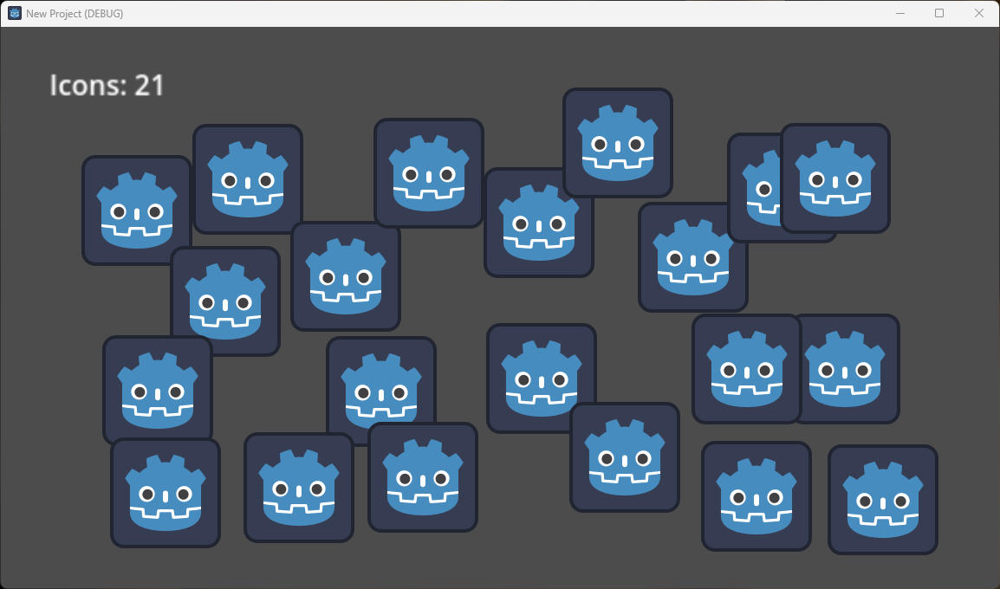

# Instantiation of a scene in GDScript

This example demonstrates two different approaches to creating a scene instance from a script in **Godot 4**. Here we create two simple independent scenes:

- Scene `Main` with a simple label
- Scene `Icon` with a small image (Godot logo)

Then we programmatically create multiple instances of the `Icon` scene in `Main` using a simple script (see [main.gd](https://github.com/ikorotkin/instantiation/blob/master/main.gd)).

This process is usually referred to as *instantiation*. It involves allocating memory for the object (in this case, a copy of the `Icon` scene with an image) and initializing or updating its properties (such as position on the screen).

In this example, the `Icon` scene will be instantiated after each mouse click. Here is the application window after 21 clicks showing the total number of icons:

## Tutorial

Here is the link to the tutorial (see Chapter 1): [https://www.amazon.com/dp/B0C4YJ1T4X](https://www.amazon.com/dp/B0C4YJ1T4X)

In this practical book, you will get hands-on experience working with Godot 4 and writing your own code in GDScript.

You will learn how to create applications – usually games – from outlining the idea to releasing the final product. The material in this book is organized systematically, from how to install Godot, set up the first scene, and add a custom script to prototyping and creating a fully functional game. You will learn how to use GDScript in your projects efficiently, even if you have no prior experience in programming and game development.
